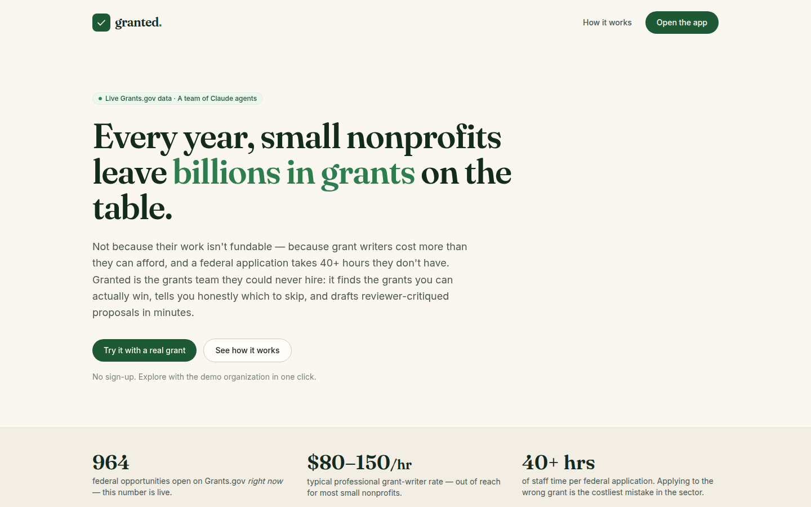
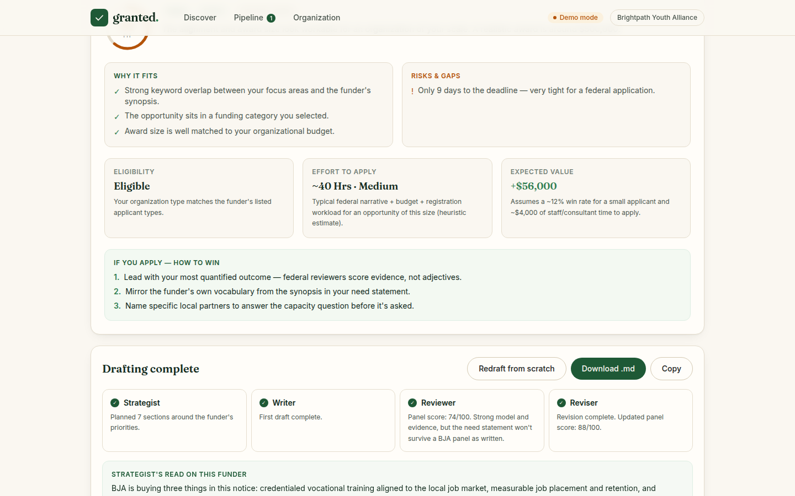
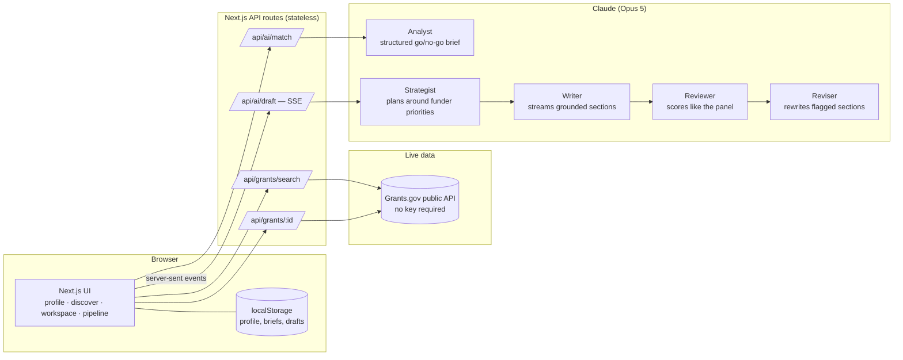

<div align="center">

# granted.

**The AI grants team for small nonprofits.**

Granted finds the federal grants your nonprofit can actually win, tells you honestly which to
skip, and drafts reviewer-critiqued proposals in minutes — powered by **live Grants.gov data**
and a **team of Claude agents**.

*Built by Shivam Gupta for the AI Builders Hackathon 2026.*



</div>

---

## The problem

There are ~1.8 million nonprofits in the US, and the overwhelming majority are small:
no development director, no grant writer, no time. Meanwhile professional grant writers run
**$80–150/hour**, and a single federal application takes **40+ hours** of staff time.

The result: the organizations doing the hardest community work are systematically locked out
of the money set aside for them, while **hundreds of federal opportunities are open on
Grants.gov right now** (the landing page shows the live count).

**The insight most tools miss:** nonprofits don't lose grants because they write badly —
they lose because they apply to the *wrong* grants and run out of time. A wrong application
costs a small org a month of capacity. So Granted starts where the money is actually lost:
**triage**, not just writing.

## What it does

| Step | What happens | Who does it |
|---|---|---|
| **1 · Profile** | Paste anything about your org (mission, website copy, annual-report excerpt) → a structured profile of your real programs and outcomes. Extraction only — it never invents your numbers. | Claude extractor (structured outputs) |
| **2 · Triage** | Live Grants.gov search, then a **go/no-go brief** per grant: eligibility as a hard gate, mission alignment, capacity vs. award size, effort estimate, and the **expected-value math shown** (`award × win odds − cost to apply`). Including an honest *"skip this one."* | The **Analyst** agent |
| **3 · Draft** | A live, streaming multi-agent pipeline writes the proposal — then critiques it like the funder's review panel and revises what got flagged, with a visible before/after score. | **Strategist → Writer → Reviewer → Reviser** |
| **4 · Track** | A deadline-sorted pipeline board with the combined expected value of your analyzed grants. | The app |

<div align="center">

</div>

### Built for trust

- **It says no.** A grant with perfect mission fit whose eligibility list excludes nonprofits
  gets a hard "skip" — try the *Smart Reentry* opportunity in the demo to see it.
- **It never invents your data.** Where a reviewer will want a figure you haven't provided,
  the Writer leaves a visible `[ADD: …]` placeholder instead of hallucinating one.
- **It shows its work.** Every recommendation carries the reasoning and the economics behind
  it. Every fallback (heuristic engine, demo replay) is labeled in the UI.

## Architecture



- **One streaming pipeline, five model calls.** The Writer streams every section through a
  chunk-boundary-safe marker parser (`lib/ai/draft.ts`, unit-tested down to 1-character
  chunks); the Reviewer returns structured notes; the Reviser rewrites only the flagged
  sections and the panel rescores. Typical end-to-end cost: **≈ $0.30–0.45 per full
  proposal** at Claude Opus 5 rates (vs. $3,000–5,000 for a human-written federal proposal).
- **Structured outputs everywhere decisions matter.** Fit briefs, plans, and reviews are
  Zod-schema-validated (`messages.parse` + `zodOutputFormat`) — the UI never parses prose.
- **Graceful degradation at every layer.** No API key → transparent heuristic fit engine
  (real scoring logic, labeled) + a replayed demo of the drafting pipeline. Grants.gov
  down → bundled snapshot. Claude errors → friendly typed-error messages, never a dead end.
- **Stateless server, private by default.** Your profile and drafts live in your browser;
  API routes hold no state. (Roadmap: Postgres + auth for teams.)

More detail in [`docs/ARCHITECTURE.md`](docs/ARCHITECTURE.md).

## Quickstart

```bash
git clone https://github.com/shi1720/ai-b-h.git
cd ai-b-h
npm install

# Optional but recommended — enables live Claude analysis + drafting:
cp .env.example .env.local        # then paste your key from console.anthropic.com
# ANTHROPIC_API_KEY=sk-ant-...

npm run dev                        # http://localhost:3000
```

**60-second tour:** open the app → *Organization* → **"Load the demo organization"** →
*Save & find grants* → analyze the **featured opportunity** (a real BJA Second Chance Act
grant) → open its workspace → **draft the proposal** and watch the agents work. Then analyze
*Smart Reentry* and watch Granted honestly tell you to skip it.

Works with **zero API keys** (demo mode, clearly labeled). Grant search is live real data
either way — the Grants.gov API is public.

## Testing

```bash
npm test                # vitest — 26 unit tests (parsers, eligibility gates, EV math,
                        # stream-parser chunk-boundary cases)
npm run build           # production build + typecheck
node scripts/smoke.mjs  # Playwright end-to-end: onboarding → discover → analyze →
                        # draft → pipeline, capturing the README screenshots
```

The smoke test earned its keep: it caught a state-loss bug (debounced localStorage writes
dropped on hard navigation) before any human would have.

## Why this is a business, not a demo

| | |
|---|---|
| **Who pays** | Small/mid nonprofits (annual budgets $100K–$5M) and the consultants who serve them |
| **Pricing** | Starter $49/mo · Team $149/mo — vs. $3–5K per proposal for a grant writer, or $1.5–3K/yr for discovery-only databases (Instrumentl, GrantStation) |
| **Unit economics** | ≈ $0.05–0.08 per fit brief, ≈ $0.30–0.45 per full draft (Opus 5) → healthy margin at any realistic usage |
| **Wedge → moat** | Free eligibility triage on live data is the wedge; the org's outcome profile + proposal history compounds into a data moat (win-rate feedback loops) |
| **Expansion** | State/city/foundation sources (990-PF data), compliance-report drafting, consultant multi-org seats |

## Roadmap

- Foundation & state grant sources (Candid/990-PF, state portals) beyond Grants.gov
- Postgres + auth: teams, shared pipelines, consultant workspaces
- Win/loss feedback loop → calibrated per-category win-rate priors in the EV model
- Funder-specific rubric packs (BJA, DOL, HHS scoring templates) for the Reviewer
- DOCX/JustGrants-format export and full application checklists

## Credits

Built by **Shivam Gupta** for the AI Builders Hackathon 2026, with Claude as pair-programmer.
Live opportunity data from the [Grants.gov](https://grants.gov) public API. Granted drafts;
humans decide — always review before submitting.
